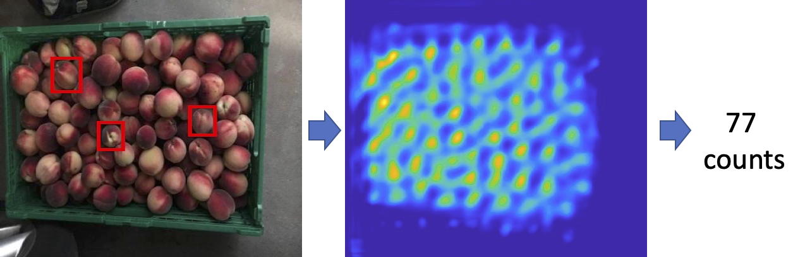

# Computer Vision for Elementary Education
> #### _Archit, Chad, Iqra | Spring '23 | AIPI 540 Computer Vision Project_
&nbsp;

## Project Description
Computer vision is an interdisciplinary field that deals with enabling machines to interpret and understand visual information in the same way that humans do. In the context of elementary education, computer vision can have a huge impact on the way students learn and interact with technology. By using computer vision algorithms, educational software and devices can analyze and interpret images and videos, providing a wealth of interactive and engaging opportunities for young children. 

For example, computer vision can be used to develop interactive educational games that help students learn various things as they grow up, such as names of animals, basic math, counting objects, etc. The technology can also be integrated into educational toys and devices, making it easier for students to visualize complex concepts and see them in action. Overall, computer vision has the potential to revolutionize the way small kids learn and interact with technology, and its integration into elementary education will play a significant role in preparing students for the technology-driven world of tomorrow.

The goal of this project is to create prototype modules that teach children some elementary education using computer vision. This allows kids to learn in a fun way using their toys.

&nbsp;
## Module 2: Learning math using toys (Object Counting)
This readme talks about the second module of object counting. We tried to count objects using an implementation of FastNet which is an unsupevised way to count objects

&nbsp;
&nbsp;
## Following is the ReadMe from the original auhors about "Learning to Count Everything" with a detailed explanation of the paper and how to run the code


&nbsp;

&nbsp;

# Learning To Count Everything


This is the official implementation of the following CVPR 2021 paper:

```
Learning To Count Everything
Viresh Ranjan, Udbhav Sharma, Thu Nguyen and Minh Hoai
Proceedings of the IEEE/CVF Conference on Computer Vision and Pattern Recognition (CVPR), 2021.
```
Link to arxiv preprint: https://arxiv.org/pdf/2104.08391.pdf

Short presentation video

[](https://youtu.be/kdpNq5V2NuA)
## Dataset download 
Images can be downloaded from here: https://drive.google.com/file/d/1ymDYrGs9DSRicfZbSCDiOu0ikGDh5k6S/view?usp=sharing

Precomputed density maps can be found here: https://archive.org/details/FSC147-GT

Place the unzipped image directory and density map directory inside the data directory.

## Installation with Conda

conda create -n fscount python=3.7 -y

conda activate fscount

python -m pip install matplotlib opencv-python notebook tqdm

conda install pytorch==1.4.0 torchvision==0.5.0 cudatoolkit=10.0 -c pytorch


## Quick demo

Provide the input image and also provide the bounding boxes of exemplar objects using a text file:

``` bash
python demo.py --input-image orange.jpg --bbox-file orange_box_ex.txt 
```

Use our provided interface to specify the bounding boxes for exemplar objects


``` bash
python demo.py --input-image orange.jpg
```


## Evaluation
We are providing our pretrained FamNet model, and the evaluation code can be used without the training.
### Testing on validation split without adaptation
```bash 
python test.py --data_path /PATH/TO/YOUR/FSC147/DATASET/ --test_split val
```
### Testing on val split with adaptation
```bash 
python test.py --data_path /PATH/TO/YOUR/FSC147/DATASET/ --test_split val --adapt
```


## Training 
``` bash
python train.py --gpu 0
```

## Citation

If you find the code useful, please cite:
```
@inproceedings{m_Ranjan-etal-CVPR21,
  author = {Viresh Ranjan and Udbhav Sharma and Thu Nguyen and Minh Hoai},
  title = {Learning To Count Everything},
  year = {2021},
  booktitle = {Proceedings of the {IEEE/CVF} Conference on Computer Vision and Pattern Recognition (CVPR)},
}
```


