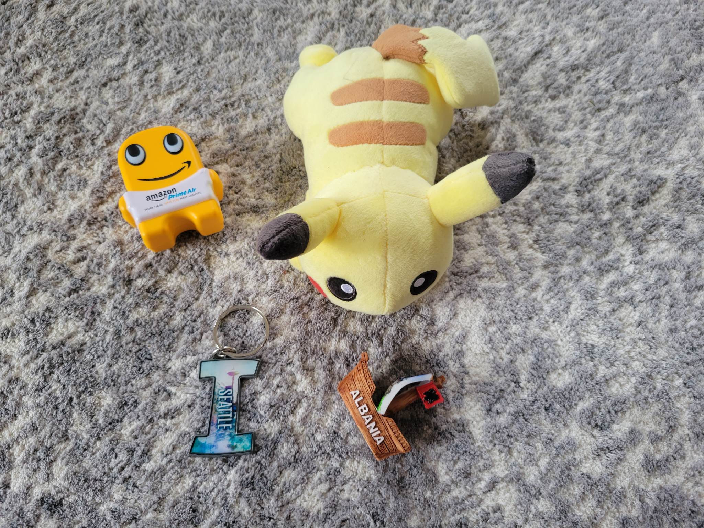
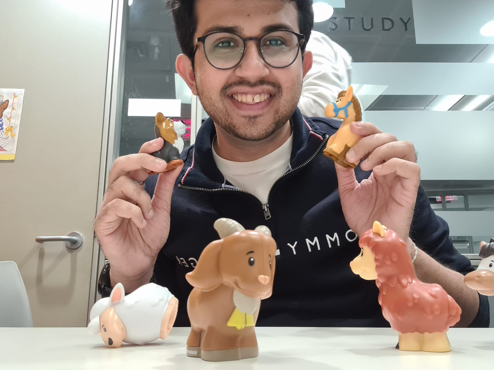

# Computer-Vision-for-Elementary-Education

The goal of this project is to create modules that teach children some elementary education using computer vision. This allows kids to learn in a fun way using their toys.

## Modules
### Module 1: Learning math using toys (Object Counting)
This module will count objects i.e. toys in a given image. This can be used to teach kids counting and basic math. For example;

Given an image like above, the program will give answer as 4.
To teach counting, a kid can add or remove toys from the frame and count will go up and down respectively.
To teach math, a question will pop up such as 2+2 and the kid will place that many toys in the picture so computer can respond if the answer (i.e. frame) is correct or not.
#### Current work
This link has a few papers on object counting along with datasets to use;
https://paperswithcode.com/task/object-counting/codeless#datasets

### Module 2: Simple Finger Math

This module for slightly older children will ask simple arithmetic questions with answers between 0 and 10, and the answers provided on webcam by how many fingers are raised. The fingers must be visible on the webcam with the palms facing the camera and the hands positioned 'upright' such that a raised finger tip is higher than the knuckle. There will be a slider control for the number of seconds allowed, and choices for addition, subtraction, or mixed math problems. The outer shell test_finger.py imports get_finger_count from the finger_counter_webcam2 module. At this point, the arithmetic questions in the outer shell are crudely built to provide addition or subtraction problems (default is 5 addition problems but variables for num_probs, which_type, and countdown length in seconds could be set by the streamlit interface). Currently it is set to NOT draw the landmarks on the hands, but could be modified through a variable assignment in finger_counter_webcam2. Of note, the program requires 

`pip install mediapipe` 


### Module 3: Learning Animal names (Object detection)
This module will detect animal toys to help learn names of animals.


## Citation

If you find the code useful, please cite:
```
@inproceedings{m_Ranjan-etal-CVPR21,
  author = {Viresh Ranjan and Udbhav Sharma and Thu Nguyen and Minh Hoai},
  title = {Learning To Count Everything},
  year = {2021},
  booktitle = {Proceedings of the {IEEE/CVF} Conference on Computer Vision and Pattern Recognition (CVPR)},
}
```


