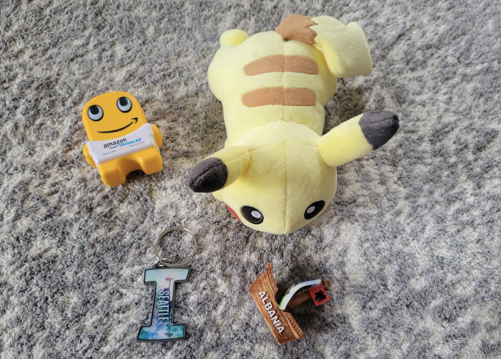
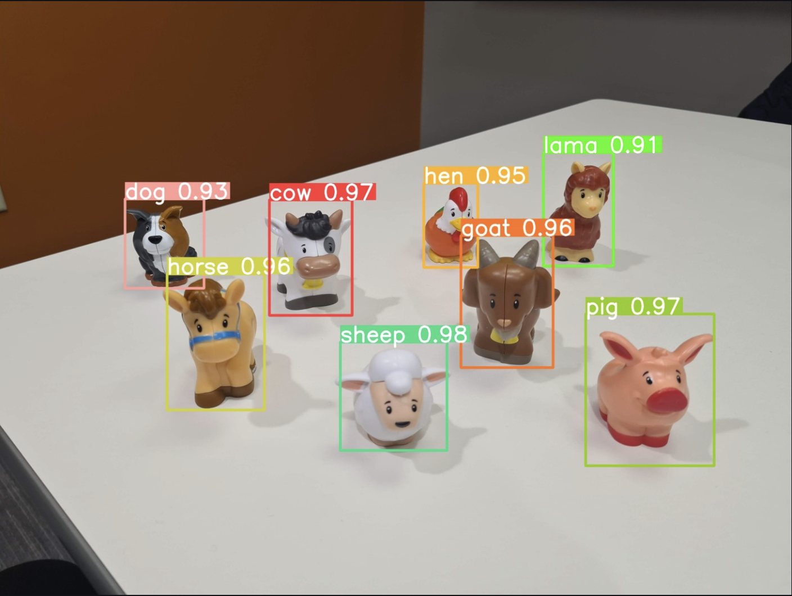
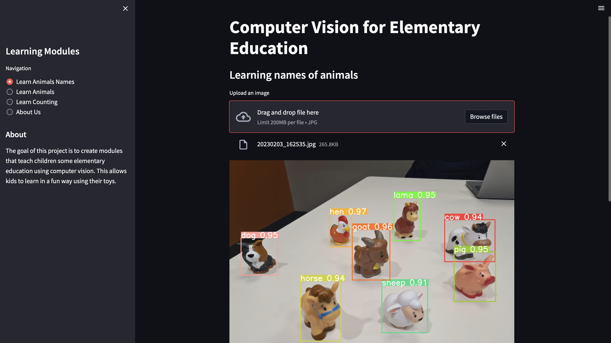

# Computer Vision for Elementary Education
> #### _Archit, Chad, Iqra | Spring '23 | AIPI 540 Computer Vision Project_
&nbsp;

## Project Description
Computer vision is an interdisciplinary field that deals with enabling machines to interpret and understand visual information in the same way that humans do. In the context of elementary education, computer vision can have a huge impact on the way students learn and interact with technology. By using computer vision algorithms, educational software and devices can analyze and interpret images and videos, providing a wealth of interactive and engaging opportunities for young children. 

For example, computer vision can be used to develop interactive educational games that help students learn various things as they grow up, such as names of animals, basic math, counting objects, etc. The technology can also be integrated into educational toys and devices, making it easier for students to visualize complex concepts and see them in action. Overall, computer vision has the potential to revolutionize the way small kids learn and interact with technology, and its integration into elementary education will play a significant role in preparing students for the technology-driven world of tomorrow.

The goal of this project is to create prototype modules that teach children some elementary education using computer vision. This allows kids to learn in a fun way using their toys.
>

&nbsp;
## Modules

&nbsp;
### Module 1: Learning Animals (Object detection & Classification)
This module will detect animal toys in the image to help kids learn names of animals.
>

&nbsp;
### Module 2: Learning math using toys (Object Counting)
This module will count objects i.e. toys in a given image. This can be used to teach kids counting and basic math. For example;
Given an image like above, the program will give answer as 4.
To teach counting, a kid can add or remove toys from the image and count will go up and down respectively.
To teach math, a question will pop up such as 2+2 and the kid will place that many toys in the picture so computer can respond if the answer (i.e. frame) is correct or not.

This link has a few papers on object counting along with datasets to use;
https://paperswithcode.com/task/object-counting/codeless#datasets

&nbsp;
### Module 3: Simple Finger Math

This module for slightly older children will ask simple arithmetic questions with answers between 0 and 10, and the answers provided on webcam by how many fingers are raised. The fingers must be visible on the webcam with the palms facing the camera and the hands positioned 'upright' such that a raised finger tip is higher than the knuckle. There will be a slider control for the number of seconds allowed, and choices for addition, subtraction, or mixed math problems. The outer shell test_finger.py imports get_finger_count from the finger_counter_webcam2 module. At this point, the arithmetic questions in the outer shell are crudely built to provide addition or subtraction problems (default is 5 addition problems but variables for num_probs, which_type, and countdown length in seconds could be set by the streamlit interface). Currently it is set to NOT draw the landmarks on the hands, but could be modified through a variable assignment in finger_counter_webcam2.

&nbsp;
## Data Capturing & Labelling
We have collected the data ourselves for the purpose of this project prototype. We bought some animal toys of [Amazon.](https://www.amazon.com/Fisher-Price-Little-People-Animal-Friends/dp/B07MM6QX97/ref=sr_1_2?crid=1CT3PFM11D3JC&keywords=animal+toys+little+people&qid=1676085377&sprefix=animal+toys+little+peop%2Caps%2C156&sr=8-2). There are eight unique animal toys in our dataset - name all[]

Multiple images of each toy were captured at different angles, positions, light intenisty and with a variety of backgrounds. All the raw images were labelled with bounding boxes. We used [Roboflow](https://roboflow.com/?ref=ultralytics) to label and prepare custom data automatically in YOLO format. We considered examples of single and multi object images. All images were resized to Yolo v5 format

&nbsp;
## Model Training and Evaluation

### Resnet18
We trained two models. We started with a simple image classifier - Resnet18. The labelled images were split into train and test datasets and loaded in Pytorch Dataset Objects. A pretrained Resnet18 model was loaded and its fully connected head was stripped off to perform transfer learning. The new trasnfer learned resnet takes in input images of size 640x640 and gives the predicted probability of presence of each class in the image.

&nbsp;
## Following are the steps to run the code and train a Resnet18 model:
**1. Place your custom datset in the following directory structure**
```
git clone https://github.com/architkaila/aipi510project
```
**2. Create a conda environment:** 
```
conda create --name environ python=3.7.15
```
**3. Install requirements:** 

&nbsp;
### YoloV5
The second and much better model than our resnet we used was the Yolo architecture. YOLO (You Only Look Once) is a state-of-the-art object detection model that is designed for real-time predictions and is highly accurate. It is an end-to-end model that performs object detection in a single forward pass and has good generalization properties, making it well-suited for real-world applications. YOLO's combination of speed and accuracy has made it popular for various use cases. We have trained our custom Yolo V5 model, which is basically an implemetation of Yolo V3 architecture in pytorch instead of the original Darknet. To train a yolo v5 we used the set of instruction provided by [ultralytics/yolov5](https://github.com/ultralytics/yolov5), the creators of this pytorch varient.

&nbsp;
## Following are the steps to run the code and train a YoloV5 model:
**1. Place your custom datset in the following directory structure**
```
git clone https://github.com/architkaila/aipi510project
```
**2. Create a conda environment:** 
```
conda create --name environ python=3.7.15
```
**3. Install requirements:** 


&nbsp;
## Running the demo (StreamLit)

**1. Clone this repository and switch to the streamlit-demo branch**
```
git clone https://github.com/iqra0908/Computer-Vision-for-Elementary-Education
```
**2. Create a conda environment:** 
```
conda create --name environ python=3.7.16
```
**3. Install requirements:** 
```
pip install -r requirements.txt
```
**4. Create a jupyter kernal from this environment:** 
```
python -m ipykernel install --user --name=environ
```
**5. Run the application**
```
streamlit run streamlit_app.py
```
**6. StreamLit Appication:**
* Here you can play around with the streamlit demo
>

## Citation

If you find the code useful, please cite:
```
@inproceedings{m_Ranjan-etal-CVPR21,
  author = {Viresh Ranjan and Udbhav Sharma and Thu Nguyen and Minh Hoai},
  title = {Learning To Count Everything},
  year = {2021},
  booktitle = {Proceedings of the {IEEE/CVF} Conference on Computer Vision and Pattern Recognition (CVPR)},
}
```

